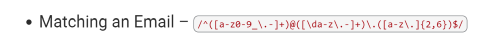

# Computer Science Regex Tutorial

Regular Expression or regex for short, are a series of special characters that define a search patter. In essense, regex can be used to find and/or replace a set of characters within a string. Since regex are a series of special characters, it can be universal and used within all programming languages. 

## Summary

The regex I will be providing a tutorial for is:
 

 

This regex matches email addresses that is broken down into three groups. The first group, may contain only lowercase letters, digits, underscores, dots, and hyphens before the @ symbol. The second group may contain only lowercase letters, digits, dots, and hyphens after the @ symbol. In the last group, after the dot (.) symbol, it may contain any lowercase letters and/or dots with further limiting the possible value of characters to a minimum and maximum of 2 and 6, respectively. 

## Table of Contents

- [Anchors](#anchors)
- [Quantifiers](#quantifiers)
- [OR Operator](#or-operator)
- [Character Classes](#character-classes)
- [Flags](#flags)
- [Grouping and Capturing](#grouping-and-capturing)
- [Bracket Expressions](#bracket-expressions)
- [Greedy and Lazy Match](#greedy-and-lazy-match)
- [Boundaries](#boundaries)
- [Back-references](#back-references)
- [Look-ahead and Look-behind](#look-ahead-and-look-behind)

## Regex Components

### Anchors

### Quantifiers

### OR Operator

### Character Classes

### Flags

### Grouping and Capturing

### Bracket Expressions

### Greedy and Lazy Match

### Boundaries

### Back-references

### Look-ahead and Look-behind

## Author

Contact me with questions at the following links:
 
GitHub User Name: itsMARPON
 
GitHub URL: https://github.com/ItsMARPON
 
Email: itsmaryyang@gmail.com
